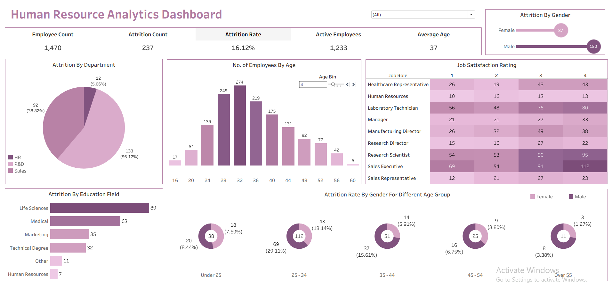

# Human Resource Analytics Dashboard (Tableau)

Live Dashboard Link: https://public.tableau.com/views/HRAnalyticsDashboard_17683138167190/HRAnalysisDashboard?:language=en-US&:sid=&:redirect=auth&:display_count=n&:origin=viz_share_link

## Project Overview
This project presents an interactive **Human Resource Analytics Dashboard** built using Tableau to analyze employee attrition and workforce trends. The dashboard helps HR teams and management identify key drivers of attrition, understand employee demographics, and monitor satisfaction levels to support data-driven workforce planning and retention strategies.

## Project Objective
To analyze employee attrition patterns and workforce metrics across departments, age groups, gender, education fields, and job roles, enabling stakeholders to make informed HR decisions and improve employee retention.

## Dashboard Preview

## Dataset Description
The dashboard is built using an HR employee dataset containing information on:
- Employee demographics (age, gender, education)
- Job roles and departments
- Attrition status
- Job satisfaction ratings
- Workforce distribution

## Key Metrics & KPIs
- Total Employee Count
- Attrition Count
- Attrition Rate
- Active Employees
- Average Employee Age

## Dashboard Overview
The dashboard provides insights through the following analyses:
- Attrition by department and education field
- Attrition comparison by gender
- Employee distribution by age group
- Job satisfaction ratings across job roles
- Attrition rate by gender for different age groups

## Dashboard Features
- Interactive filters for dynamic analysis
- KPI cards for quick workforce overview
- Visual breakdown of attrition trends by multiple dimensions
- Clear comparison across departments, roles, and demographics

## Key Insights
- Overall attrition rate stands at **16.12%**
- Attrition is higher among **male employees** compared to female employees
- Most attrition occurs in the **25–34 age group**
- Departments such as **Sales and R&D** show higher attrition levels
- Lower job satisfaction ratings are associated with higher attrition in several roles

## Tools & Technologies
- **Tableau** – Dashboard development and visualization
- **Data Preparation** – Cleaned and structured prior to visualization

## Outcome
This project demonstrates the ability to:
- Analyze HR data to identify attrition drivers
- Design intuitive and interactive Tableau dashboards
- Translate HR metrics into actionable business insights
- Support workforce planning and employee retention strategies

## Contact
- Tanushri Barsainya
- Github: https://github.com/tanushri1506
- LinkedIn: https://www.linkedin.com/in/tanushri1506/
